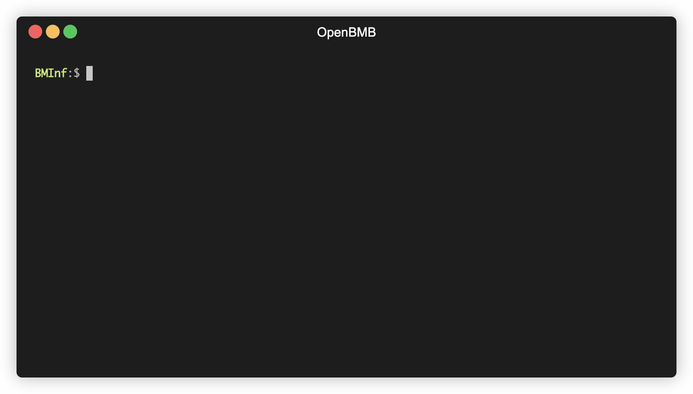

# Installation

## From pip (Recommended)
```
pip install bminf
```

## From Source
```
git clone https://github.com/OpenBMB/BMInf.git
cd BMInf
python setup.py install
```

## From Docker 
```
docker run -it --gpus 1 -v $HOME/.cache/bigmodels:/root/.cache/bigmodels --rm openbmb/bminf python3 examples/fill_blank.py
```

After installation, you can run an example in the ``examples`` folder to find if it is installed correctly.

```
python examples/fill_blank.py
```



## Hardware Requirement

Here we list the minimum and recommended configurations for running BMInf. 

| | Minimum Configuration | Recommended Configuration |
|-|-|-|
| Memory | 16GB | 24GB
| GPU | NVIDIA GeForce GTX 1060 6GB | NVIDIA Tesla V100 16GB
| PCI-E |  PCI-E 3.0 x16 |  PCI-E 3.0 x16

GPUs with compute capability 6.1 or higher are supported by BMInf. Refer to the [table](https://en.wikipedia.org/wiki/CUDA#GPUs_supported) to check whether your GPU is supported. 

## Software Requirement

BMInf requires CUDA version >= 10.1 and all the dependencies can be automaticlly installed by the installation process.

- **python** >= 3.6
- **requests**
- **tqdm** 
- **jieba**
- **numpy** 
- **cpm_kernels** >= 1.0.9

If you want to use the backpropagation function with PyTorch, make sure `torch` is installed on your device.

