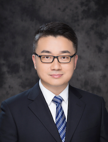

# About Us
BMInf is developed and maintained by OpenBMB (Open Big Model Base). OpenBMB is founded and supported by Beijing Academy of Artificial Intelligence (BAAI) and Tsinghua University. 

The goal of OpenBMB is to build the model base and toolkits for large-scale pre-trained language models. We aim to accelerate the process of training, tuning, and inference for big models and lower the barriers to use them. Based on this, we further aim to build the open-source community to promote the open-source ecosystems of pre-trained language models, build the AI infrastructure, and define the application paradigm in the intelligent era.

## Our Team

### Manager

Zhiyuan Liu

### Member

<table>
    <tr>
        <td >
 Guoyang Zeng
</td>
        <td >
 Jie Zhou
</td>
        <td >
 Chao Jia
</td>
    </tr>
    <tr>
        <td >
 Huadong Wang
</td>
        <td >
 Xu Han
</td>
        <td >
 Ning Ding
</td>
    </tr>
    <tr>
        <td >
 Zhengyan Zhang
</td>
        <td >
 Yujia Qin
</td>
        <td >
 Xiangrong Yin
</td>
    </tr>
</table>

## Contact Us
