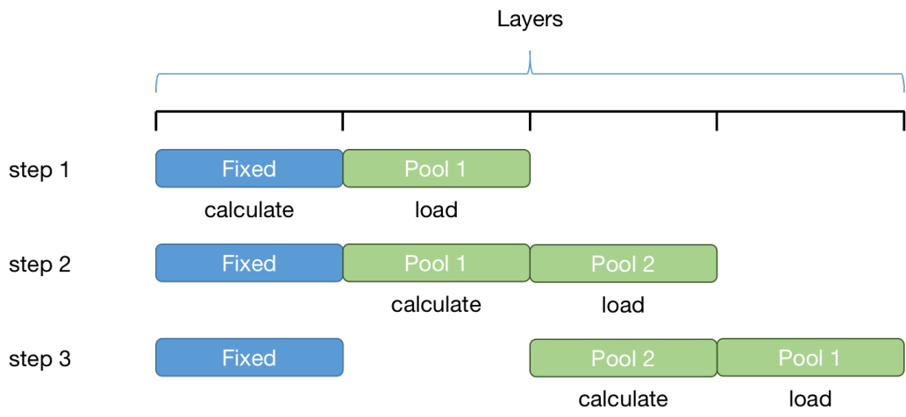

# 低资源推理技术

这篇文章将简单的介绍大模型推理工具包的运行机制，并展示我们如何在GTX 1060 GPU上运行CPM2-11B模型。我们目前使用的这些技术是基于CUDA以及相关数学库实现的，所以目前只支持NVIDIA的GPU。在之后的更新中，我们将会考虑加入对ROCm的支持，让我们的工具包也可以运行在AMD的GPU上。

## 背景介绍

CPM2-11B（悟道·文源）模型发布于2021年6月，你可以在 [TsinghuaAI](https://github.com/TsinghuaAI/)中获取更多和它相关的信息，包括模型预训练和微调的代码。CPM2-11B是一个巨大的预训练语言模型，它包含了11B（110亿）个参数，在公开发布的模型文件中每个参数使用了16-bit（2 byte）的浮点数来存储，总共的模型文件大小也达到了22GB。对于一块普通的机械硬盘来说，光是读取这样大小的模型就已经会花费数分钟的时间，更不用说将这样庞大的数据放进内存和GPU中进行后继的运算。

在这个工具包的设计过程中，我们预设了GTX 1060 6GB显存和16GB内存这样的最低配置要求，根据这样的配置要求，我们使用了一系列的技术让一个大规模的预训练语言模型可以运行在一台普通的电脑上，并进行相关的推理运算。

## 相关技术

### 模型压缩

对于一个22GB的模型来说，要使用它并进行推理就需要一块显存大小至少为22GB的GPU。满足这样条件的GPU通常是很昂贵的（例如 V100 32GB, A100, RTX 3090），为了能让模型能在更小显存的GPU上运行，最直接的想法就是对模型进行压缩。在保留模型原有的结构的基础下，我们将模型中占比最大的线性层参数，从16bit浮点数转换为了int8格式，使用这种方法几乎可以让模型的大小缩小50%，但是与此同时带来的后果则是模型具体的效果会有所下降。

为了让压缩后的模型更贴近于原来的效果，我们在将参数转换为int8格式以后还进行了几千次迭代的微调，来让模型适应新的参数精度。在经过几千次迭代更新后，压缩后的模型基本上已经达到了和原始模型相近的能力。在具体的PPL指标中，压缩后的模型相比于压缩前只相差了5~10左右。

### 显存调度

在使用了模型压缩技术后，我们成功将原本大小22GB的模型压缩到了11GB，但这还远远不够。虽然对于NVIDIA旗舰级别GPU来说（例如：GTX 1080Ti, RTX 2080Ti），11GB显存已经是一个可以摸到的门槛了，但是考虑到在推理过程中我们还需要使用一些额外的空间来存储运算的中间变量，这样的显存容量依旧不太够用。另外，能够拥有这样旗舰级别显卡的用户数量也是很少的，因为它的价格太过于昂贵，对于大多数人来说，像GTX 1060这样甜点级的GPU才更受青睐。

要让一个11GB大小的模型运行在显存容量只有6GB的GPU上，我们需要对显存的使用进行精细的管理，将需要用于进行运算的模型参数提前准备好，放置在显存中，而对于暂时不需要用到的部分，则放置在CPU内存中。这样的技术其实早在CUDA 8中就已经被引入了，叫做Unified Memory，它是一种类似于CPU虚拟内存的机制，将CPU内存作为GPU显存的二级存储来使用。不过由于一些原因，我们没有直接使用这样的技术，而是手动实现了一个它的类似版本，以模型层为最小的粒度来调度GPU显存资源。

在具体的实现过程中，我们使用了两个独立的内存池，交替的用于计算和加载参数。并通过将计算的时间和参数加载的时间重叠来提升整体的推理效率。通过调整每次加载和运算的层数，可以将大模型适配到不同显存容量的GPU。根据我们的一些实验表明，将更多的模型层驻留在GPU中通常可以带来更好的效率，在整个模型推理的过程中，瓶颈往往在于内存和显存的拷贝，这也是工具包之后会优化的一个方面。

## 总结

通过模型压缩和内存调度技术，我们成功的让CPM2-11B模型运行在了GTX 1060 6GB的GPU上，并且达到了类似于打字机一样的运行效率（1字/秒）。当然，除了CPM2-11B这样的大模型以外，我们的工具包也提供了一些更小规模的模型，它们也是用了同样的技术，不过相比于CPM2会运行得更快一些。
